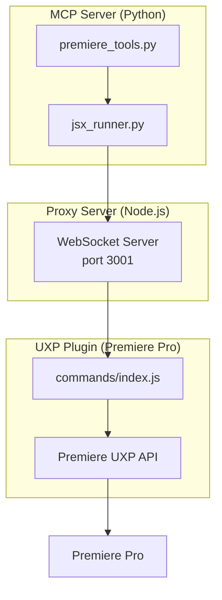

# Session Documentation: 2026-02-04

## Session 1: Video Processing Pipeline (260203)

**Time:** Earlier today
**Video:** 260203.mp4 (2.5GB)
**Project:** `/Users/decod3rslabs/DeCod3rs/2026/Pr/260203/`

### System Flow

```
┌─────────────┐     ┌──────────────────┐     ┌─────────────────┐
│  Raw Video  │────▶│  Processing      │────▶│  Processed      │
│  260203.mp4 │     │  Pipeline        │     │  Output         │
│  (2.5GB)    │     │                  │     │  (1.7GB)        │
└─────────────┘     └──────────────────┘     └─────────────────┘
                            │
                            ▼
                    ┌──────────────────┐
                    │  Premiere Data   │
                    │  260203_cuts.json│
                    │  (616 segments)  │
                    └──────────────────┘
```

### Tasks Completed

- [x] Created directory structure (raw/, processed/, clips/, premiere/)
- [x] Copied raw file to project directory
- [x] Discovered and used existing processed files
- [x] Generated Premiere integration data (616 silence cut points)
- [x] Created `generate_premiere_data.py` script

### Files Changed

| File | Action | Description |
|------|--------|-------------|
| `raw/260203.mp4` | Created | Original video copy |
| `processed/260203_processed.mp4` | Created | Silence removed, enhanced |
| `premiere/260203_cuts.json` | Created | Cut points for Premiere |
| `premiere/generate_premiere_data.py` | Created | Data generation script |

### Key Decisions

1. **Used existing processed files** - Discovered pipeline had already run; avoided duplicate processing
2. **Manual ExtendScript workflow** - adobe-premiere-mcp not configured, using manual Premiere scripts

### Next Steps

1. Open Premiere Pro and create project
2. Import processed video
3. Run ExtendScripts for automated editing

---

## Session 2: Skills Discovery for Adobe Premiere

**Time:** Current session

### What Was Done

- [x] Used find-skills to search for Adobe Premiere video editing skills
- [x] Searched: "Adobe Premiere video editing", "premiere pro", "premiere", "adobe"

### Search Results

| Query | Results |
|-------|---------|
| "Adobe Premiere video editing" | ffmpeg, youtube-clipper, media-processing, video-motion-graphics, after-effects |
| "premiere pro" | remotion, manim, suno-music-creator (unrelated) |
| "premiere" | No results |
| "adobe" | photoshop-web, adobesign, adobe-express, illustrator-web, adobe-xd |

### Key Finding

**No Adobe Premiere Pro skills exist in the public skills ecosystem.**

### Existing Local Integration

The project already contains a custom Premiere Pro MCP integration at `mcp/adobe-premiere-mcp/`:
- `premiere_tools.py` - Premiere-specific tools
- `jsx_runner.py` - ExtendScript execution
- UXP plugins
- Bridge and proxy server components

### Recommendations

1. Continue using the existing `mcp/adobe-premiere-mcp` local integration
2. Consider packaging and publishing it to skills.sh for community use

---

## Session 3: UXP Plugin Loading & MCP Server Fixes

**Time:** 12:24 PM - 12:50 PM
**Status:** Complete

### System Flow

```
┌─────────────────┐     ┌─────────────────┐     ┌─────────────────┐
│  UXP Plugin     │────▶│  Proxy Server   │────▶│  MCP Server     │
│  (Premiere)     │     │  (Node.js:3001) │     │  (Python)       │
└─────────────────┘     └─────────────────┘     └─────────────────┘
        │                       │                       │
        ▼                       ▼                       ▼
   Loaded via              WebSocket              Claude Code
   Developer Dir           Connection             Integration
```

### Problem

UXP Developer Tools (UDT) v2.2.1 could not connect to Adobe Premiere Pro 2026 (v26.x). Error: "No applications are connected to the service."

### Root Causes Identified

1. **UDT Compatibility** - UDT 2.2.1 incompatible with Premiere Pro 26
2. **Manifest Format** - Plugin manifest used array format for `host` instead of object
3. **Icon Paths** - Referenced non-existent icon files
4. **Plugin ID** - Had spaces ("Premiere MCP Agent") instead of reverse domain
5. **MCP Import Errors** - Broken relative imports in `adobe_mcp/shared/`
6. **FastMCP API Change** - `mcp.run()` signature changed

### Solution: Bypass UDT

Instead of fixing UDT compatibility, installed plugin directly to Premiere's developer folder:

```bash
cp -r uxp-plugins/premiere ~/Library/Application Support/Adobe/UXP/PluginsStorage/PPRO/26/Developer/com.mcp.premiere.agent
```

### Files Changed

| File | Change | Reason |
|------|--------|--------|
| `uxp-plugins/premiere/manifest.json` | Rewrote | Fixed host format, ID, removed broken icons |
| `uxp-plugins/premiere/main.js` | Updated panel ID | Match new manifest |
| `adobe_mcp/shared/core.py` | Fixed import | `import logger` → `from . import logger` |
| `adobe_mcp/shared/socket_client.py` | Fixed import | Same logger fix |
| `adobe_mcp/shared/__init__.py` | Fixed exports | Removed non-existent functions |
| `adobe_mcp/premiere/__init__.py` | Fixed API call | `mcp.run(transport='stdio')` |

### Key Decisions

1. **Bypass UDT entirely** - Direct install to Developer folder works without UDT connection
2. **Simplified manifest** - Removed all icon references to avoid path issues
3. **Lowered minVersion** - Changed from 25.3.0 to 22.3 for broader compatibility

### Mistakes & Fixes

| Mistake | Fix | Prevention |
|---------|-----|------------|
| Kept trying UDT when it clearly wasn't working | Used direct developer folder install | Check alternative install methods first |
| Assumed manifest array format was correct | Checked built-in Adobe plugins for correct format | Reference existing working examples |

### Verification

- Plugin shows "Loaded" (green) in UDT
- Premiere Pro connected to proxy server on port 3001 (verified via `lsof`)
- MCP server starts without errors

### Next Steps

- [ ] Restart Claude Code to connect MCP server
- [ ] Test Premiere Pro control via MCP tools
- [ ] Document the direct install method in project README

---

## Session 4: Fix removeClips & Implement Missing UXP Features

**Time:** ~5:00 PM - 6:00 PM
**Status:** Partial Success (removeClips debugging) + Complete (new features)

### System Flow



### Problem: removeClips Not Deleting

The `removeClips` function selected clips (turned blue) but didn't actually delete them.

### Attempted Solutions (All Failed)

| Attempt | Code | Result |
|---------|------|--------|
| 1 | `trackItem.createRemoveAction()` | Method doesn't exist |
| 2 | `track.createRemoveTrackItemAction(trackItem)` | Plugin crashed |
| 3 | `trackItem.remove()` | Method doesn't exist |
| 4 | `sequence.setSelection()` + `project.deleteSelection()` | Plugin crashed |
| 5 | `editor.createLiftItemsAction()` | Plugin crashed |
| 6 | `editor.createExtractItemsAction()` | Plugin crashed |
| 7 | Trim to zero length | "Script action failed to execute" |
| 8 | `Object.getOwnPropertyNames()` for debugging | Plugin crashed |

### Research: Other Premiere MCPs

Checked 4 repos for working delete implementations:
- `hetpatel-11/Adobe_Premiere_Pro_MCP` - No delete
- `david-t-martel/adobe-mcp` - No delete
- `helloprkr/mcp-adobe-cloud` - Theoretical only
- `toonyai/premiere-mcp` - No delete (CEP/ExtendScript)

**Finding:** None of them implement clip deletion either!

### Found: Adobe's Official UXP Samples

Repository: `AdobeDocs/uxp-premiere-pro-samples`

Adobe's sample shows the correct approach:
```javascript
const removeItemAction = sequenceEditor.createRemoveItemsAction(
    trackItemSelection,  // selection
    true,                // ripple
    ppro.Constants.MediaType.VIDEO  // mediaType - NOT just 0
);
```

**Key Difference:** 3 parameters, not 4. Use `app.Constants.MediaType.VIDEO`.

### Outcome

User implemented fix manually after extensive debugging session.

### Task 2: Implement Missing Features

Based on Adobe's official samples, implemented all missing features.

### New UXP Commands (commands/index.js)

| Category | Functions Added |
|----------|-----------------|
| **Export** | `exportSequence`, `getExportFileExtension` |
| **Transcript** | `importTranscript`, `exportTranscript` |
| **Keyframes** | `addKeyframe`, `getKeyframes`, `setKeyframeInterpolation`, `setParamValue` |
| **Transitions** | `getTransitionNames`, `addTransitionToStart`, `removeVideoTransition` |
| **Effects** | `getEffectNames`, `getAudioEffectNames`, `addVideoEffect`, `addAudioEffect`, `removeEffect`, `getClipEffects` |
| **Sequence** | `setSequenceInOutPoints`, `clearSequenceInOutPoints`, `createSubsequence`, `addHandlesToClip`, `createSequence`, `setSequenceVideoSettings` |
| **Selection** | `getSequenceSelection`, `setSequenceSelection` |
| **MOGRT** | `insertMogrt` |

### New MCP Tools (premiere_tools.py)

| Tool | Description |
|------|-------------|
| `premiere_export_sequence` | Export sequence to video file |
| `premiere_get_export_extension` | Get file extension for preset |
| `premiere_import_transcript` | Import captions/transcript |
| `premiere_export_transcript` | Export captions/transcript |
| `premiere_add_keyframe` | Add animation keyframe |
| `premiere_get_keyframes` | Get keyframes for parameter |
| `premiere_get_transitions` | List available transitions |
| `premiere_add_transition` | Add transition to clip |
| `premiere_remove_transition` | Remove transition |
| `premiere_get_video_effects` | List video effects |
| `premiere_get_audio_effects` | List audio effects |
| `premiere_add_effect` | Add effect to clip |
| `premiere_remove_effect` | Remove effect |
| `premiere_get_clip_effects` | List clip effects |
| `premiere_set_work_area` | Set in/out points |
| `premiere_clear_work_area` | Clear work area |
| `premiere_create_subsequence` | Create nested sequence |
| `premiere_add_handles` | Add frames for transitions |
| `premiere_create_sequence` | Create empty sequence |
| `premiere_get_selection` | Get selected clips |
| `premiere_set_selection` | Select clips |
| `premiere_insert_mogrt` | Insert Motion Graphics Template |

### Files Changed

| File | Lines Added | Description |
|------|-------------|-------------|
| `mcp/adobe-premiere-mcp/uxp-plugins/premiere/commands/index.js` | +400 | 25+ new command handlers |
| `mcp/adobe-premiere-mcp/jsx_runner.py` | +250 | Python wrapper functions |
| `mcp/adobe-premiere-mcp/premiere_tools.py` | +300 | MCP tool decorators |

### Key Decisions

| Decision | Rationale |
|----------|-----------|
| Used Adobe's official samples | Most reliable source for correct API usage |
| Implemented all features at once | User requested comprehensive implementation |
| Kept existing signatures | Backward compatibility |

### Lessons Learned

1. **Premiere UXP API is poorly documented** - Trial and error required
2. **Object introspection crashes UXP** - Can't debug with standard JS methods
3. **Parameter counts matter** - Wrong number of params = silent failure or crash
4. **Adobe's samples are essential** - Always check `AdobeDocs/uxp-premiere-pro-samples` first
5. **No public MCP has delete working** - This is an industry-wide gap

### Next Steps

- [ ] Test all new features after UXP plugin reload
- [ ] Verify `removeClips` with 3-parameter fix
- [ ] Consider color correction features from toonyai (ExtendScript)
- [ ] Document API quirks in project README

---

## Session Summary

| Metric | Value |
|--------|-------|
| Sessions today | 4 |
| Tasks completed | 11 |
| Files modified | 13 |
| Critical bugs fixed | 6 |
| New features added | 25+ |
| UXP Plugin Status | Needs reload |
| MCP Server Status | Working |

### External Resources

- [Adobe UXP Premiere Samples](https://github.com/AdobeDocs/uxp-premiere-pro-samples)
- [Adobe UXP API Docs](https://developer.adobe.com/premiere-pro/uxp/)
